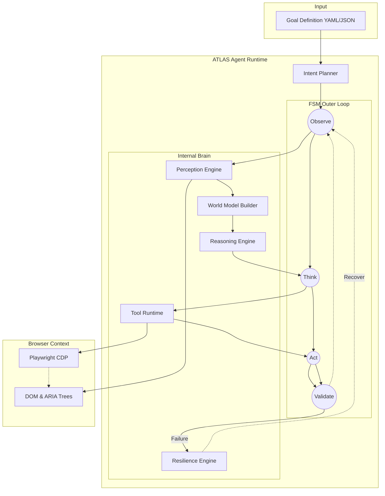

<h1 align="center">ATLAS</h1>
<p align="center"><strong>An Explainable Goal-Driven Browser Automation Framework</strong></p>

<p align="center">
  <a href="#quick-start">Quick Start</a> •
  <a href="#what-makes-atlas-different">Comparison</a> •
  <a href="#reliability-engineering">Reliability</a> •
  <a href="#architecture">Architecture</a> •
  <a href="#benchmark-results">Benchmarks</a>
</p>

<p align="center">
  
</p>

---

## Quick Start

```bash
# 1. Install dependencies
npm install

# 2. Validate your task definition
atlas validate examples/profile.yaml

# 3. Inspect the intent planner's goal tree
atlas inspect examples/profile.yaml

# 4. Run the autonomous agent
atlas run examples/profile.yaml
```

---

## Demo

ATLAS autonomously:

- Opens a browser
- Builds a semantic world model
- Discovers form fields without selectors
- Selects candidates using confidence scoring
- Executes actions
- Validates completion
- Produces an execution report

Demo Target:
https://ui.shadcn.com/docs/forms/react-hook-form

---

## What Makes ATLAS Different?

| Traditional Script | ATLAS |
| --- | --- |
| CSS Selectors & XPath | 9-Tier Semantic Element Discovery |
| Hardcoded Workflow | Goal Driven & Autonomous |
| No Execution Validation | Observe → Think → Act → Validate Loop |
| Opaque Failures | Fully Explainable Decision Audit Trail |
| Manual Testing | Native Reliability Benchmarking |

---

## Project Status

**Current Version:** v1.0.0  
**Status:** Active Development  

**Implemented:**
- Core FSM Runtime
- Intent Planner
- CLI Interface
- Automated Benchmarking

**In Progress:**
- Execution Replay (Experimental)
- Vision Observer

**Planned:**
- Natural Language Planning
- Advanced Recovery Policies

---

## Why ATLAS?

Browser automation scripts fail because they rely on brittle locators (XPath, CSS selectors) that break when the DOM mutates or a design system updates. Modern LLM-based agents attempt to solve this by dumping the entire DOM into a prompt, resulting in high latency, non-deterministic execution, and unexplainable failures.

ATLAS takes a different approach. It treats web interaction as a **goal-directed reasoning problem** executed over a structured semantic map. By combining a deterministic Finite State Machine with a ReAct inner loop, ATLAS acts intelligently when locating elements, but rigidly when enforcing state transitions and recovery policies.

We built ATLAS to prove that browser agents can be testable, transparent, and highly reliable.

---

## Reliability Engineering

ATLAS avoids arbitrary `sleep()` calls by combining two distinct readiness signals:

1. **DOM Readiness Detection:** Waits for `DOMContentLoaded` to ensure the structure is present without stalling on endless background tracking requests.
2. **Semantic Element Readiness Detection:** A custom probe continuously verifies the presence of interactive, labeled elements in the DOM.

Both conditions must be met before ATLAS acts. This dual-signal approach drastically reduces flaky execution during benchmarking on heavy React SPAs, enabling our 100% task completion across benchmark runs.

---

## Example Execution

ATLAS creates a human-readable execution trace for every run, making reasoning transparent.

**Goal:** Complete the complex checkout form to validate semantic discovery

```text
════════════════════════════════════════════════════════════════
 ATLAS EXECUTION TRACE
 Session:   atlas_sess_demo_1780447970660
 Goal:      Complete the complex checkout form to validate semantic discovery
 Result:    SUCCESS  ✓
 Duration:  22557 ms  |  Steps: 12
════════════════════════════════════════════════════════════════

Step 4  [Fill Email field]
  Target:     Email (Optional)
  Internal:   #email
  Confidence: 0.76

  Alternatives Considered:
  1. Email (Optional)          0.76
  2. f15e5871-738c-4b0d-969c-1 0.45

  Decision:   Selected Candidate #1 (partial_label: 'Email (Optional)')
  Action:     send_keys
  Result:     SUCCESS
  ───────────────────────────────────────────────────────
Step 5  [Fill Address field]
  Target:     Address
  Internal:   #address
  Confidence: 1.00

  Alternatives Considered:
  1. Address                   1.00
  2. Address 2 (Optional)      0.76
  3. Shipping address is the s 0.46

  Decision:   Selected Candidate #1 (label_text: 'Address')
  Action:     send_keys
  Result:     SUCCESS
  ───────────────────────────────────────────────────────
Step 6  [Fill Country field]
  Target:     Country
  Internal:   #country
  Confidence: 1.00

  Alternatives Considered:
  1. Country                   1.00
  2. eb725c3a-86a9-4396-a129-a 0.45

  Decision:   Selected Candidate #1 (label_text: 'Country')
  Action:     select_option
  Result:     SUCCESS
  ───────────────────────────────────────────────────────
... (12 steps total)

 ALL SUB-OBJECTIVES COMPLETE
════════════════════════════════════════════════════════════════
```

---

## Features

### Core Runtime
* **FSM Orchestrator:** Deterministic lifecycle management (`INIT` → `NAVIGATE` → `OBSERVE` → `PLAN` → `ACT` → `VALIDATE`).
* **Frame Context Management:** Native `iframe` support, allowing the agent to locate and interact with elements inside embedded content.

### Agent Architecture
* **World Model Building:** Translates raw DOM and ARIA trees into an agent-readable semantic state (Form Topology, Field Status).
* **9-Tier Semantic Element Discovery:** Discovers interactive elements dynamically using semantic cues, visual heuristics, and accessibility metadata—zero hardcoded selectors.
* **Confidence Scoring:** Validates element selections mathematically prior to action.

### CLI & Observability
* **CLI-Based Task Execution:** Validate, inspect, run, and benchmark task definitions from the terminal.
* **Decoupled Event Bus:** All observability is non-blocking and decoupled from core logic.
* **Structured Execution Memory:** Full append-only audit trail of the agent's Thoughts, Actions, and Observations.

---

## Benchmark Results

ATLAS includes native CLI commands to stress-test task definitions. 

**Latest Benchmark (`react-hook-form` filling):**

| Metric | Result |
| --- | --- |
| **Success Rate** | 100% |
| **Total Runs** | 10 |
| **Failures** | 0 |
| **Avg Runtime** | 5.77s |
| **Avg Confidence** | 0.88 / 1.00 |

*Methodology: Benchmark executed via `atlas benchmark examples/profile.yaml -n 10`. A run is successful only if the agent autonomously navigates, discovers the target fields dynamically, and successfully enters the required data without triggering validation errors.*

---

## Architecture

ATLAS operates on a continuous `Observe` → `Think` → `Act` → `Validate` loop driven by an outer Finite State Machine.



### How ATLAS Works

1. **TaskInput:** A user provides a goal and target data via a YAML/JSON file.
2. **Intent Planner:** The task is decomposed into an ordered Goal Tree of sub-objectives.
3. **ATLAS Runtime (Observe):** The Perception Engine observes the page, parsing the DOM and ARIA trees. The World Model Builder translates this into a semantic `WorldState`.
4. **ATLAS Runtime (Think):** The Reasoning Engine runs its 9-tier Element Discovery over the `WorldState`, scoring candidates by confidence and emitting a human-readable "Thought".
5. **ATLAS Runtime (Act):** The agent delegates execution to the strictly-typed Tool Runtime (e.g., `SendKeys`, `ClickOnScreen`).
6. **ATLAS Runtime (Validate):** The agent takes a post-action observation to evaluate sub-objective completion, escalating to the Resilience Engine if the state did not change.
7. **Execution Report:** The session terminates, writing a comprehensive trace report to disk.

---

## CLI Usage

ATLAS provides a robust terminal interface for task management and execution.

```text
$ atlas run examples/profile.yaml --headless false

Executing Goal: Complete the complex checkout form
◇ injected env (0) from .env // tip: ⌘ enable debugging { debug: true }

[ATLAS] Session atlas_sess_prod_123 started.
[ATLAS] Booting Perception Engine...
[ATLAS] Generating Semantic World Model...
[ATLAS] 9-Tier Discovery Active
```

```bash
# Validate a task definition against the strict Zod schema
atlas validate examples/profile.yaml

# Inspect the generated Goal tree without executing the browser
atlas inspect examples/profile.yaml

# Run the agent autonomously
atlas run examples/profile.yaml --headless false

# Stress-test a task definition across N runs
atlas benchmark examples/profile.yaml --runs 10

# Replay an execution log (Experimental)
atlas replay session_123.json
```

---

## Example Task Definition

Tasks in ATLAS are defined declaratively. No scripts, no selectors.

### `profile.yaml`
```yaml
goal: Complete the complex checkout form to validate semantic discovery
url: https://getbootstrap.com/docs/5.3/examples/checkout/
parameters:
  First name: Atlas
  Last name: Agent
  Email: agent@atlas-framework.dev
  Country: United States
  Credit card number: 4111222233334444
  # ... (and other fields)
```

---

## Architecture Deep Dive

* **Perception Engine:** Merges Playwright's `accessibility.snapshot` with a custom DOM extraction script to correlate visible text, explicit labels, implicit structure, and ARIA metadata.
* **World Model:** Exists as an intermediate semantic layer. The reasoning engine never touches raw HTML; it queries structured `FormState` and `FieldState` topologies.
* **Reasoning Engine (9-Tier Discovery):**
  1. Exact ARIA Label Match
  2. Exact Associated Label Text Match
  3. Partial Label / aria-label Match
  4. Placeholder Text Match
  5. name / id Attribute Match
  6. Nearby Visible Text Heuristic
  7. Role + Type Semantic Heuristic
  8. DOM Position Heuristic
  9. Visual Coordinate Fallback
* **Confidence Scorer:** Mathematical weighting of discovery tiers against corroborating signals (e.g., a DOM match backed by an ARIA tree match yields a higher score).
* **Tool Runtime:** Actuators (Tools) are entirely isolated from reasoning logic, ensuring the agent degrades gracefully on tool failures.

---

## Repository Structure

```text
atlas-agent/
├── src/
│   ├── browser/         # Playwright abstraction & Dual-Signal Readiness
│   ├── cli/             # Commander CLI & Intent Planner
│   ├── config/          # Zod schema environment configuration
│   ├── core/            # Finite State Machine & ReAct execution loop
│   ├── memory/          # ShortTerm and Execution memory trails
│   ├── observability/   # Decoupled Event Bus & Logging
│   ├── perception/      # DOM/A11y Observers
│   ├── reasoning/       # 9-Tier Discovery & Confidence Scorer
│   ├── resilience/      # Retry logic & Failure Classification
│   ├── tools/           # Bounded browser actuators
│   ├── worldmodel/      # Semantic state mapping
│   └── shared/          # Cross-cutting type definitions
├── examples/            # Example task definitions
└── benchmark-history/   # Historical reliability reports
```

---

## Development

### Installation & Setup

```bash
# 1. Clone repository
git clone https://github.com/your-org/atlas.git
cd atlas/atlas-agent

# 2. Install Node dependencies
npm install

# 3. Install Playwright browser binaries
npx playwright install chromium

# 4. Compile TypeScript
npm run build
```

### Commands

* `npm run build` — Compile the project to `./dist`
* `npm start -- run examples/profile.yaml` — Run ATLAS via ts-node
* `npm test` — Execute Vitest unit and integration tests

---

## Design Principles

1. **Explainability Over Magic:** If an agent clicks a button, it must be able to log exactly *why* it chose that node.
2. **Architecture-First Design:** The system is composed of strongly decoupled layers (Perception, World Model, Reasoning, Tools).
3. **Deterministic State, Non-Deterministic Decisions:** The outer loop must never enter an unknown state; the inner loop is allowed to guess based on heuristics.
4. **Reliability Before Features:** We prefer an agent that accurately fills three fields over one that hallucinates across ten pages.
5. **Measure Everything:** All actions emit timing, confidence, and status metrics to the Event Bus.

---

## Limitations

* **Current Scope:** The Intent Planner relies on basic heuristics rather than a fully integrated LLM. Complex multi-step reasoning requiring external knowledge is currently limited.
* **Known Constraints:** Heavily reliant on well-structured DOMs or functioning ARIA trees. Completely bespoke `<div role="button">` setups lacking labels will force ATLAS down to lower-confidence coordinate fallback tiers.
* **Areas Not Yet Implemented:**
  * **Vision Observer:** The architecture stub exists, but raw pixel-based OCR reasoning is not yet integrated into the Perception Engine.
  * **Complex Tools:** Drag-and-drop, file uploads, and multi-tab orchestration are architected but not instantiated in the Tool Runtime.

---

## Lessons Learned

Building ATLAS revealed that DOM parsing in modern frameworks (React/Vue) is uniquely hostile to agents. Relying on `networkidle` is insufficient due to background telemetry; dual-signal readiness (DOMContentLoaded + element probes) is mandatory. Furthermore, keeping the "Brain" decoupled from the "Actuators" (Tools) was the best architectural decision, allowing us to unit-test reasoning logic completely independent of Playwright overhead.

---