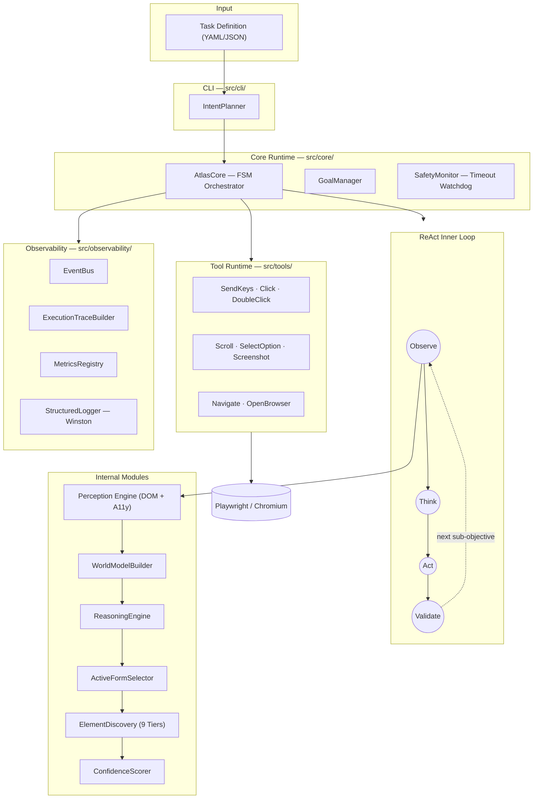
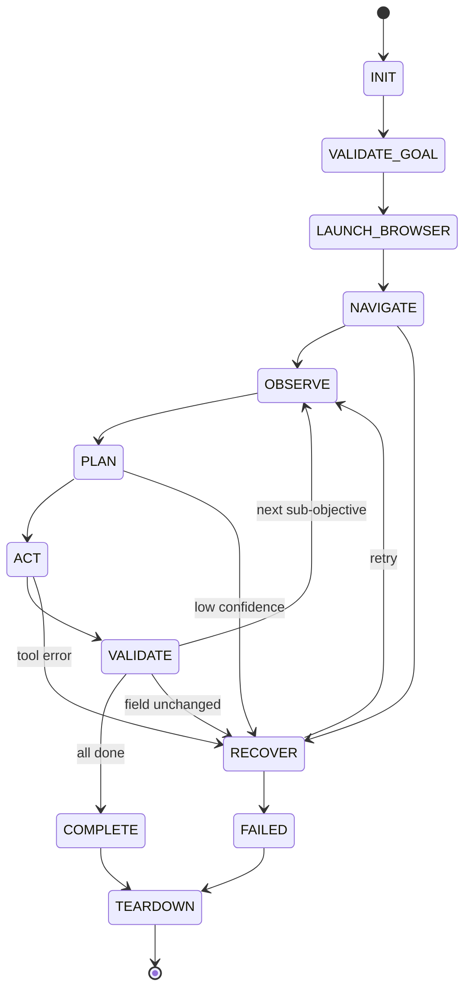
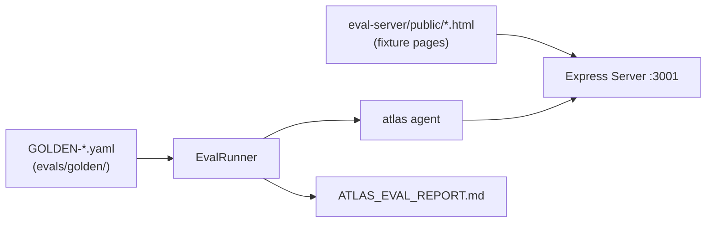

<h1 align="center">ATLAS</h1>
<p align="center"><strong>Autonomous Task &amp; Locator Agent System</strong></p>
<p align="center">An Explainable, Goal-Driven Browser Automation Framework</p>

<p align="center">
  <a href="#quick-start">Quick Start</a> •
  <a href="#architecture">Architecture</a> •
  <a href="#cli-reference">CLI Reference</a> •
  <a href="#configuration">Configuration</a> •
  <a href="#evaluation-harness">Evaluation Harness</a> •
  <a href="#benchmark-results">Benchmarks</a>
</p>

<p align="center">
  
</p>

---

## What Is ATLAS?

Browser automation scripts fail because they are written in terms of **structure** (CSS selectors, XPath) rather than **intent** (fill the Name field). The moment a design system updates or a React component re-renders, every hardcoded selector breaks.

ATLAS inverts this. You describe a goal. ATLAS reasons about the page semantically, scores every candidate element by confidence, executes the action with the highest-confidence match, then validates the outcome — all without a single hardcoded selector.

```yaml
# This is your entire task definition. No selectors. No scripts.
goal: Fill my profile form
url: https://ui.shadcn.com/docs/forms/react-hook-form
parameters:
  Name: John Doe
  Description: Backend Engineer
```

```
atlas run examples/profile.yaml
```

The framework is built around a single loop:

```
Observe → Think → Act → Validate
```

driven by a typed **Finite State Machine** with 11 explicit states, a **9-tier semantic element discovery** pipeline, and a **confidence scorer** that makes every decision numerically auditable.

---

## Why ATLAS?

| Traditional Script | ATLAS |
| --- | --- |
| CSS Selectors & XPath | 9-Tier Semantic Element Discovery |
| Hardcoded Workflow | Goal-Driven Sub-Objective Sequencing |
| Fails on DOM mutation | Confidence-scored re-observation on each step |
| Silent failures | Full execution audit trail + typed FSM |
| No self-correction | Resilience Engine with recovery transitions |
| Manual reliability testing | Native `benchmark` + `eval` CLI commands |

---

## Quick Start

```bash
# 1. Clone and install dependencies
git clone https://github.com/your-org/atlas.git
cd atlas/atlas-agent
npm install

# 2. Install Playwright's Chromium binary
npx playwright install chromium

# 3. Register the global CLI
npm run build
npm link

# 4. Validate a task definition (dry-run, no browser)
atlas validate examples/profile.yaml
# ✓ Validation successful. Task definition is structurally sound.

# 5. Inspect the generated goal tree (no browser)
atlas inspect examples/profile.yaml

# 6. Run the agent
atlas run examples/profile.yaml --headless false
```

> **Development shortcut:** Skip the build step with ts-node:
> ```bash
> npm start -- run examples/profile.yaml --headless false
> ```

---

## Architecture

ATLAS is a **layered, dependency-injected system**. Each layer communicates only with adjacent layers. The browser is never touched directly by reasoning logic.



### FSM State Transitions

The outer FSM guarantees that ATLAS is **always in a known state**. No implicit control flow. Every transition is validated.



### Request Lifecycle

```
1.  atlas run examples/profile.yaml

2.  CLI: parse YAML → Zod validate → IntentPlanner.plan()
    → Goal { label, targetUrl, subObjectives[] }

3.  runAgent() [src/index.ts]
    Wires all dependencies via constructor injection.
    AtlasCore.run(goal)

4.  FSM: VALIDATE_GOAL → LAUNCH_BROWSER → NAVIGATE
    Playwright launches Chromium. page.goto(url).
    Domain allowlist checked if strictDomainCheck=true.

5.  ReAct Loop (per SubObjective):

    OBSERVE:
      DOMObserver injects a UUID into every interactive element.
      A11yObserver captures Playwright's accessibility.snapshot().
      ObservationAssembler merges both into Observation{}.
      WorldModelBuilder maps forms, fields, labels, and statuses.
      ActiveFormSelector ranks multiple forms by semantic relevance.

    PLAN:
      ElementDiscovery runs all 9 tiers against the WorldState.
      ConfidenceScorer weights each candidate.
      If top confidence < minConfidenceThreshold → RECOVER.
      → Decision { action, targetSelector, confidence, alternatives[] }

    ACT:
      ToolRuntime.execute(decision.action) → Playwright action.
      All tool inputs validated by Zod before execution.

    VALIDATE:
      Post-action OBSERVE + WorldModel rebuild.
      Compare field.currentValue against expectedValue.
      If COMPLETE → GoalManager.markComplete() → next sub-objective.
      If unchanged → RECOVER.

6.  TEARDOWN
    browser.forceClose().
    ExecutionTraceBuilder writes report to stdout + execution_trace.txt.
    MetricsRegistry emits phase timings.
```

---

## 9-Tier Element Discovery

The core of ATLAS's selector-free approach. Every field lookup runs through all applicable tiers in order. The highest-confidence match across all tiers wins.

```
Tier 1 │ Exact ARIA Label Match          confidence: 1.00
Tier 2 │ Exact Associated Label Text     confidence: 0.95
Tier 3 │ Partial Label / aria-label      confidence: 0.76
Tier 4 │ Placeholder Text Match          confidence: 0.72
Tier 5 │ name / id Attribute Match       confidence: 0.68
Tier 6 │ Nearby Visible Text Heuristic   confidence: 0.55
Tier 7 │ Role + Type Semantic Heuristic  confidence: 0.50
Tier 8 │ DOM Position Heuristic          confidence: 0.40
Tier 9 │ Coordinate Fallback             disabled by default
```

Every decision is logged with its **tier**, **confidence score**, **matched signal**, and **all alternatives considered** — the agent never silently guesses.

### Active Form Selection

When a page contains multiple forms (e.g. Shipping + Billing address forms), ATLAS does not guess. The `ActiveFormSelector` ranks all discovered forms by:

1. **Goal keyword overlap** with form metadata (`id`, `heading`, `legend`, `aria-label`)
2. **Sub-objective keyword overlap** with form metadata
3. **Field label overlap** — does this form contain fields that match the current sub-objective?

The highest-scoring form becomes the exclusive context for element discovery, preventing cross-form contamination. This behavior is regression-tested in `GOLDEN-002` (see [Evaluation Harness](#evaluation-harness)).

---

## Example Execution

ATLAS produces a human-readable trace for every run:

```text
ATLAS EXECUTION REPORT

Goal     Complete the complex checkout form
Status   SUCCESS
Runtime  22.6s
Confidence 0.91
Steps    12/12

Execution Timeline
[01] First name            ✓ 1.00
[02] Last name             ✓ 1.00
[03] Email                 ✓ 0.76
[04] Address               ✓ 1.00
[05] Address 2             ✓ 0.76
[06] Country               ✓ 1.00
[07] State                 ✓ 1.00
[08] Zip                   ✓ 1.00
[09] Same address toggle   ✓ 0.88
[10] Card number           ✓ 0.95
[11] Expiry                ✓ 0.88
[12] CVV                   ✓ 0.88

Insights
• Exact Matches:    8
• Semantic Matches: 4
• Recoveries:       0
• Avg Confidence:   0.91

Performance
Navigation     2.9s
Observation    0.2s
Reasoning      0.1s
Actions        0.2s
Validation     0.2s

CERTIFIED SUCCESS
```

Enable `--verbose` for a step-by-step trace including all form candidates, element alternatives, and reasoning chains:

```bash
atlas run examples/profile.yaml --verbose
```

The verbose trace is also written to `./execution_trace.txt` after every run.

---

## CLI Reference

```bash
atlas <command> [options]
```

### `atlas validate <file>`

Validates a YAML or JSON task definition against the Zod schema. No browser is launched.

```bash
atlas validate examples/profile.yaml
# ✓ Validation successful. Task definition is structurally sound.
```

---

### `atlas inspect <file>`

Parses the task file and prints the generated Goal tree as JSON. Use this to verify the IntentPlanner's sub-objective decomposition before running.

```bash
atlas inspect examples/profile.yaml
```

---

### `atlas run <file>`

Launches the full ATLAS agent against a task definition.

```bash
atlas run examples/profile.yaml
atlas run examples/profile.yaml --headless false   # visible browser
atlas run examples/profile.yaml --verbose          # step-by-step trace
```

| Flag | Default | Description |
| --- | --- | --- |
| `--headless <bool>` | `true` | Run Chromium headlessly |
| `--verbose` | `false` | Emit step-level trace with form candidates, alternatives, and reasoning |

**Exit codes:** `0` = SUCCESS, `1` = FAILURE or PARTIAL.

---

### `atlas benchmark <file>`

Stress-tests a task definition across N sequential runs. Reports success rate, average runtime, and per-run details. Saves a timestamped JSON report to `./benchmark-history/`.

```bash
atlas benchmark examples/profile.yaml --runs 10
atlas benchmark examples/profile.yaml -n 20 --headless true
```

| Flag | Default | Description |
| --- | --- | --- |
| `-n, --runs <number>` | `10` | Number of sequential runs |
| `--headless <bool>` | `true` | Run Chromium headlessly |

**Report saved to:** `./benchmark-history/<YYYY-MM-DD>_<filename>.json`

---

### `atlas eval <directory | file>`

Runs the ATLAS Evaluation Harness against GOLDEN-* YAML fixtures. Requires the eval server.

```bash
# Step 1: Start the local fixture server (separate terminal)
npx ts-node eval-server/server.ts
# → [EvalServer] Running on http://localhost:3001

# Step 2: Run the eval suite
atlas eval evals/golden/forms/
atlas eval evals/golden/forms/GOLDEN-001.yaml
```

Outputs:
- Per-test `✅ PASS` / `❌ FAIL` with failure reasons to stdout
- `./ATLAS_EVAL_REPORT.md` written to cwd

**Exit codes:** `0` = all tests pass, `1` = any failure.

---

### `atlas replay <session.json>`

*(Planned — stub implementation)* Will replay a previous session from the `ExecutionReplayLog`. Currently prints a placeholder and exits.

---

## Task Definition Schema

Tasks are declared in YAML or JSON. No scripts. No selectors.

```yaml
goal: <string>        # Natural language goal description
url: <string>         # Target URL (must be a valid URL)
parameters:           # Key-value map of field labels to values
  <Field Label>: <value>
```

**Full example:**

```yaml
goal: Complete the complex checkout form to validate semantic discovery
url: https://getbootstrap.com/docs/5.3/examples/checkout/
parameters:
  First name: Atlas
  Last name: Agent
  Email: agent@atlas-framework.dev
  Country: United States
  Credit card number: 4111222233334444
  Expiration: 04/27
  CVV: "137"
```

The `parameters` keys are used directly as the `targetFieldDescription` in each sub-objective. The agent resolves these labels semantically — they do not need to match DOM attributes exactly.

---

## Evaluation Harness

ATLAS ships a deterministic evaluation framework for regression-testing agent behavior against controlled HTML fixtures.

### Architecture



### Fixture Format

```yaml
id: GOLDEN-002
name: Duplicate Labels (Shipping vs Billing)
url: http://localhost:3001/duplicate-labels.html
goal: Fill out the shipping address
parameters:
  Name: "Jane Doe"
  Address: "123 Shipping Lane"
expected:
  success: true
  activeFormId: shipping_form       # which form must be selected
  expectedElements:                 # selectors that must have been filled
    - shipping_name
    - shipping_address
  forbiddenElements:                # selectors that must NOT be touched
    - billing_name
    - billing_address
```

### Validation Logic (from `EvalRunner.ts`)

| Check | Field | Behavior |
|---|---|---|
| Run outcome | `expected.success` | Compares `result.status === 'SUCCESS'` |
| Elements filled | `expected.expectedElements` | Each string must appear in a filled selector |
| Elements untouched | `expected.forbiddenElements` | Each string must NOT appear in filled selectors |
| Form selected | `expected.activeFormId` | Active form ID must appear in filled selectors |

### Current Fixture Coverage

| Fixture | Tests | Status |
|---|---|---|
| `GOLDEN-001` — Simple Contact Form | Basic field discovery on a clean form | ✅ PASS |
| `GOLDEN-002` — Duplicate Labels | Active form selection on a multi-form page | ✅ PASS |

---

## Benchmark Results

ATLAS is reliability-benchmarked as a first-class workflow, not an afterthought.

**Latest Benchmark — `react-hook-form` form filling (10 runs):**

| Metric | Result |
| --- | --- |
| **Success Rate** | 100% |
| **Total Runs** | 10 |
| **Failures** | 0 |
| **Avg Runtime** | 5.77s |
| **Max Runtime** | 17.49s |
| **Avg Confidence** | 0.88 / 1.00 |

**Methodology:** `atlas benchmark examples/profile.yaml -n 10`. A run is successful only if the agent autonomously navigates, discovers target fields without hardcoded selectors, and fills them without triggering validation errors. Reports are stored in `benchmark-history/`.

---

## Tool Runtime

All browser actuations go through a strictly-typed, pluggable `ToolRuntime`. Each tool validates its inputs with Zod before execution.

| Tool Name | Action | Required Input |
|---|---|---|
| `open_browser` | Launch Playwright Chromium | browser config |
| `navigate_to_url` | Navigate page | `url`, `allowedDomains` |
| `send_keys` | Type text into a field | `elementId`, `value` |
| `click_on_screen` | Click element or screen coordinates | `elementId` or `x`/`y` |
| `double_click` | Double-click element or coordinates | `elementId` or `x`/`y` |
| `scroll` | Scroll page or bring element into view | `elementId`, `direction`, `amount` |
| `select_option` | Select a dropdown option by visible text | `elementId`, `text` |
| `take_screenshot` | Capture current page state | `label`, `fullPage` |

All tools are registered at startup in `src/index.ts` and dispatched by name through `ToolRuntime.execute()`.

---

## Observability

Every execution is fully instrumented. All events flow through a decoupled `EventBus` — core logic never blocks on logging.

**Events emitted (from `src/observability/events.ts`):**

| Event | When |
|---|---|
| `SessionStarted` | Agent begins |
| `ObservationReady` | Perception phase complete |
| `WorldModelBuilt` | WorldState constructed |
| `DecisionMade` | Reasoning engine selects action |
| `ActionExecuted` | Tool returns result |
| `RecoveryAttempted` | FSM enters RECOVER state |
| `SubObjectiveComplete` | A field is successfully filled |
| `FailureDetected` | Fatal or recoverable error |
| `SessionComplete` | Agent terminates |

**Winston logger** subscribes to the event bus. Set `logging.format = 'pretty'` for human-readable local output.

**Output artifacts produced per run:**

```
./execution_trace.txt                              — Verbose step trace (always written)
./screenshots/<sessionId>/                         — Per-step screenshots
./screenshots/<sessionId>/manifest.json            — Screenshot index
./benchmark-history/<date>_<file>.json             — Benchmark reports
./ATLAS_EVAL_REPORT.md                             — Eval suite report (atlas eval only)
```

---

## Configuration

All configuration is fully typed via Zod (`src/config/ATLASConfig.ts`). Defaults are safe for production use. Override via environment variables or by modifying `ConfigLoader.ts`.

### Environment Variables

| Variable | Default | Description |
|---|---|---|
| `ATLAS_HEADLESS` | `true` | Show browser window (`false` = headed) |
| `ATLAS_STRICT_DOMAIN_CHECK` | `true` | Block navigation outside the target domain |
| `ATLAS_ASYNC_EVENTS` | `false` | Dispatch events asynchronously |

Copy `.env.example` to `.env` and edit as needed.

### Configuration Reference

<details>
<summary><strong>Browser</strong></summary>

| Key | Default | Description |
|---|---|---|
| `browser.headless` | `true` | Headless mode |
| `browser.viewport.width` | `1280` | Viewport width |
| `browser.viewport.height` | `720` | Viewport height |
| `browser.launchTimeoutMs` | `30000` | Playwright launch timeout |

</details>

<details>
<summary><strong>Navigation</strong></summary>

| Key | Default | Description |
|---|---|---|
| `navigation.waitUntil` | `domcontentloaded` | Page load event to await (`domcontentloaded` \| `load` \| `networkidle`) |
| `navigation.timeoutMs` | `30000` | Navigation timeout |
| `navigation.maxRetries` | `3` | Navigation retry count |
| `navigation.allowedDomains` | `[]` (all) | Domain allowlist for SSRF mitigation |
| `navigation.strictDomainCheck` | `true` | Enforce allowedDomains |

</details>

<details>
<summary><strong>Reasoning</strong></summary>

| Key | Default | Description |
|---|---|---|
| `reasoning.minConfidenceThreshold` | `0.40` | Below this → trigger RECOVER |
| `reasoning.highConfidenceThreshold` | `0.80` | Above this → high-confidence tier |
| `reasoning.maxScrollCycles` | `3` | Max scroll-and-retry attempts |
| `reasoning.enableSelfHealing` | `true` | Retry on confidence failure |
| `reasoning.enableCoordinateFallback` | `false` | Enable Tier 9 (coordinate fallback) |

</details>

<details>
<summary><strong>Resilience</strong></summary>

| Key | Default | Description |
|---|---|---|
| `resilience.maxRecoveryAttempts` | `3` | Max RECOVER transitions per session |
| `resilience.backoffBaseMs` | `500` | Base backoff delay |
| `resilience.backoffMultiplier` | `2.0` | Exponential backoff multiplier |
| `resilience.maxBackoffMs` | `8000` | Backoff ceiling |

</details>

<details>
<summary><strong>Execution</strong></summary>

| Key | Default | Description |
|---|---|---|
| `execution.maxSteps` | `50` | Max ReAct loop iterations before FAILED |
| `execution.globalTimeoutMs` | `120000` | Global session timeout (2 minutes) |

</details>

<details>
<summary><strong>Screenshots</strong></summary>

| Key | Default | Description |
|---|---|---|
| `screenshots.enabled` | `true` | Enable screenshot capture |
| `screenshots.outputDir` | `./screenshots` | Screenshot root directory |
| `screenshots.onAction` | `true` | Capture screenshot after each action |
| `screenshots.onFailure` | `true` | Capture screenshot on failure |

</details>

<details>
<summary><strong>Logging</strong></summary>

| Key | Default | Description |
|---|---|---|
| `logging.level` | `INFO` | Log level (`DEBUG` \| `INFO` \| `WARN` \| `ERROR`) |
| `logging.format` | `json` | Output format (`json` \| `pretty`) |
| `logging.redactFields` | `['password','token','secret','key']` | Fields redacted in log output |

</details>

---

## Repository Structure

```text
atlas-agent/
├── src/
│   ├── browser/          # Playwright abstraction, FrameManager, dual-signal ReadinessDetector
│   ├── cli/              # Commander CLI, IntentPlanner, TaskInput Zod schema
│   ├── config/           # ATLASConfig Zod schema + env-based ConfigLoader
│   ├── core/             # FSM Orchestrator (AtlasCore), GoalManager, SafetyMonitor
│   ├── eval/             # EvalRunner — deterministic evaluation harness
│   ├── memory/           # ShortTermMemory (WorldState window), ExecutionReplayLog
│   ├── observability/    # EventBus, ExecutionTraceBuilder, MetricsRegistry, Winston logger
│   ├── perception/       # DOMObserver (UUID injection), A11yObserver, ObservationAssembler
│   ├── reasoning/        # ReasoningEngine, ElementDiscovery (9 tiers), ConfidenceScorer,
│   │                     # ActiveFormSelector
│   ├── resilience/       # ResilienceEngine, FailureClassifier, RetryManager
│   ├── shared/           # Cross-cutting type definitions
│   ├── tools/            # ToolRuntime + all 8 browser actuators
│   └── worldmodel/       # WorldModelBuilder, FormDiscovery, FieldStatusEvaluator
├── eval-server/
│   ├── server.ts         # Express server serving fixture HTML pages on :3001
│   └── public/           # HTML fixture pages for deterministic eval
├── evals/
│   └── golden/forms/     # GOLDEN-*.yaml evaluation fixtures
├── examples/             # Example task definitions
├── __tests__/            # Vitest unit + integration specs
├── benchmark-history/    # Historical reliability JSON reports
├── docs/assets/          # Demo GIF and static assets
├── .env.example          # Environment variable reference
├── .gitignore
├── package.json
└── tsconfig.json         # Strict TypeScript, path aliases (@core/*, @tools/*, etc.)
```

---

## Development

### Commands

| Command | Description |
|---|---|
| `npm run build` | Compile TypeScript to `./dist` |
| `npm start -- <cmd>` | Run CLI via ts-node (no build required) |
| `npm test` | Run Vitest unit tests |
| `npm link` | Register `atlas` as a global CLI command |

### Test Coverage

Four spec files cover the critical reasoning path:

| Spec | What It Tests |
|---|---|
| `BrowserController.spec.ts` | Element registration and Playwright locator mapping |
| `CompletionEvaluator.spec.ts` | Post-action field value comparison logic |
| `ReasoningEngine.spec.ts` | 9-tier discovery + confidence scoring decisions |
| `WorldModelBuilder.spec.ts` | Form/field topology construction from raw observations |

Run targeted tests:

```bash
npx vitest run __tests__/ReasoningEngine.spec.ts
```

### Adding a New Tool

1. Create `src/tools/tools/YourTool.ts` — implement `ATLASTool<TInput, TData>`
2. Define the input schema with Zod
3. Export from `src/tools/index.ts`
4. Register in `src/index.ts` via `toolRuntime.register(new YourTool())`

### Adding an Eval Fixture

1. Add an HTML page to `eval-server/public/`
2. Create `evals/golden/<category>/GOLDEN-NNN.yaml` with an `expected` block
3. Run `atlas eval evals/golden/<category>/` to verify

---

## Design Principles

1. **Explainability Over Magic** — Every element selection produces a logged `confidence`, `discoveryTier`, `matchedSignal`, and ranked `alternatives[]`. The agent never silently guesses.

2. **Architecture-First** — Perception, World Model, Reasoning, and Tools are strictly separated layers. Reasoning logic never calls Playwright directly.

3. **Deterministic State, Heuristic Decisions** — The FSM outer loop is fully deterministic (11 states, explicit transitions, typed in source). The inner loop is allowed to reason heuristically. This makes failures debuggable.

4. **Reliability Before Features** — The benchmark harness and eval harness are first-class engineering tools, not afterthoughts. ATLAS measures its own reliability.

5. **Measure Everything** — Every execution phase (`navigationMs`, `observationMs`, `reasoningMs`, `actionMs`, `validationMs`) is timed and reported.

---

## Security Model

| Mechanism | How It Works |
|---|---|
| **Domain allowlist** | `navigation.allowedDomains` + `strictDomainCheck` blocks navigation to off-domain URLs, mitigating SSRF in automated pipelines |
| **Field value redaction** | Configurable `logging.redactFields` redacts sensitive parameter values (passwords, tokens, secrets) from all log output |
| **UUID-based addressing** | Elements are addressed by injected UUIDs, not user-visible selectors, preventing selector injection attacks |
| **Input validation** | All task definitions and tool inputs are validated with Zod before any execution |
| **No external LLM calls** | ATLAS's reasoning is fully local and deterministic — no data leaves the machine |

---

## Limitations

These are accurate as of the current implementation. No future capabilities are claimed.

- **Intent Planner is heuristic, not LLM-driven.** `IntentPlanner` maps `parameters` keys directly to sub-objectives. Complex goals requiring external knowledge or dynamic decomposition are out of scope. The source code has a placeholder for an LLM integration path (`Evolution 3`).
- **ResilienceEngine is minimal.** The `RECOVER` FSM state is correctly triggered, but recovery strategies beyond "retry the observation" are not yet implemented.
- **No drag-and-drop.** File upload, drag-and-drop, and multi-tab orchestration are not implemented.
- **No Vision/OCR perception.** The `ScreenshotService` and `TakeScreenshot` tool are implemented, but pixel-level reasoning (OCR, visual element detection) is not integrated into the Perception Engine.
- **No parallel execution.** The agent runs a single browser session sequentially. Multi-agent concurrency is not supported.
- **DOM-dependent.** Deeply bespoke `<div role="button">` patterns with no labels, ARIA, or visible text will fall to low-confidence tiers. The agent will recover, but confidence will be low.

---

## Benchmark Results (Detail)

```json
{
  "date": "2026-06-02T23:56:06.338Z",
  "runs": 10,
  "successRate": 100,
  "avgRuntimeMs": 5774,
  "maxRuntimeMs": 17485,
  "failures": 0
}
```

*Benchmark target: `react-hook-form` demo on `ui.shadcn.com`. Max runtime spike on run 10 is attributable to Playwright navigation cold-start variance, not agent logic. Average confidence 0.88 reflects Tier 3 (partial label) matches on the shadcn form, which uses implicit labels.*

---

## Lessons Learned

Building ATLAS produced several concrete findings:

1. **`networkidle` is unreliable on modern SPAs.** React SPAs fire background telemetry indefinitely. Waiting for `networkidle` causes indefinite hangs. Dual-signal readiness (`DOMContentLoaded` + semantic element probe) is the correct approach.

2. **The World Model layer is mandatory.** Giving the reasoning engine direct access to raw DOM caused coupling and made reasoning logic untestable. Introducing `WorldState` as an intermediate semantic type allows the `ReasoningEngine` to be unit-tested completely without Playwright.

3. **Confidence scoring transforms debugging.** When the agent makes the wrong call, the alternatives list shows exactly which tiers fired and why a particular candidate won. This alone saves hours of debugging.

4. **Decoupling Tools from reasoning is not optional.** Tool failures would previously crash the core loop. The strict `ToolRuntime` abstraction lets the FSM transition to `RECOVER` gracefully instead of throwing.

5. **Multiple forms on one page are a real problem.** Billing + Shipping forms with identical field names (Name, Address) will both match at Tier 1. The `ActiveFormSelector` was added specifically to prevent cross-form contamination — and GOLDEN-002 proved it was necessary.